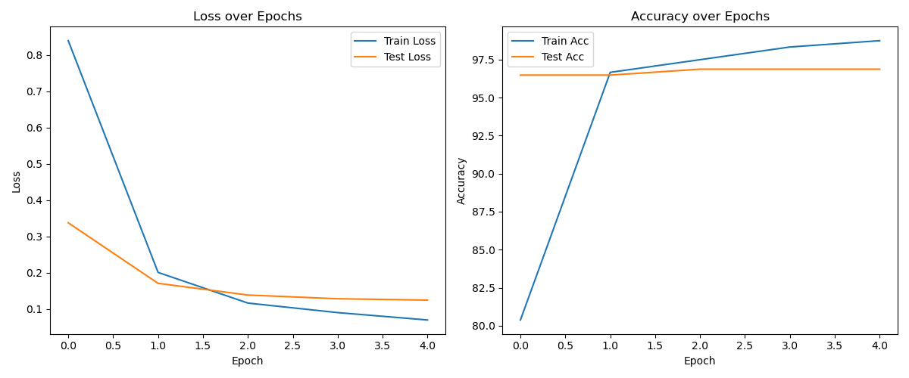

# Classify

一个基于 PyTorch 的多类别图像分类项目，使用 Vision Transformer (ViT-B/16) 进行迁移学习，识别 5 类目标：ants、bees、pizza、steak、sushi。

## 项目描述

本项目提供了完整的训练、评估与单图预测流程：

- 训练入口：train.py
- 预测入口：test.py
- 模型结构：默认使用 torchvision 的 ViT-B/16，并替换分类头为 5 类输出
- 数据组织：按 ImageFolder 风格划分 train/test 子目录
- 训练产物：
	- 最优权重保存到 classifyproject/models/best_model.pth
	- 训练曲线保存到 classifyproject/results/exp_result.png

当前数据集目录结构如下：

- data/train/ants, bees, pizza, steak, sushi
- data/test/ants, bees, pizza, steak, sushi

## 环境配置

### 1. Python 版本

建议使用 Python 3.9 - 3.11。

### 2. 创建虚拟环境（Anaconda）

```powershell
conda create -n classify python=3.9 -y
```

### 3. 安装依赖

```powershell
pip install torch==2.1.2+cu118 torchvision==0.16.2+cu118 --extra-index-url https://download.pytorch.org/whl/cu118
pip install matplotlib pillow torchinfo
```

### 4. 运行训练

```powershell
python train.py --data_dir <data_dir> --epochs 5 --batch_size 32 --device cpu --plot
```

如需使用 GPU，可将 --device cpu 改为 --device cuda。

### 5. 运行单图预测

```powershell
python test.py --image_path classifyproject\make_prediction\OIP-C.jpg --device cpu
```

预测脚本会输出：

- 预测类别
- 预测置信度
- 各类别概率分布

## 结果展示

### 1. 训练曲线

训练结束后，若开启 --plot，会生成并保存结果图：

- classifyproject/results/exp_result.png

示例：



### 2. 最优模型

- 路径：classifyproject/models/best_model.pth
- 保存策略：按测试集准确率提升自动覆盖保存当前最优权重

### 3. 推理展示

可使用 make_prediction 目录中的测试图像进行可视化预测，脚本会弹出图片并显示预测结果。

## 目录说明

- train.py：训练主程序
- test.py：单图预测脚本
- modular/dataset.py：数据集与 DataLoader 构建
- modular/model.py：自定义 TinyVGG（当前训练默认未启用）
- modular/engine.py：训练与验证循环
- modular/utils.py：日志打印、曲线绘制、随机种子设置
- models/：模型权重保存目录
- results/：实验结果图保存目录